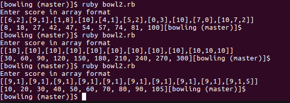

Assumptions
1. A strike in the last frame earns 2 more throws
2. A spare in the last frame earns 1 more throw
3. There will be no additional scores for strikes scored from the last frame onwards

README   
1. Run bowl.rb in terminal
2. The program will take in 24 inputs (for 12 frames). Example, input 1 denotes score for throw 1 for frame 1. Press Enter to insert null input. Example, if frame is a strike, key in "10" for throw 1 and enter for throw 2.

